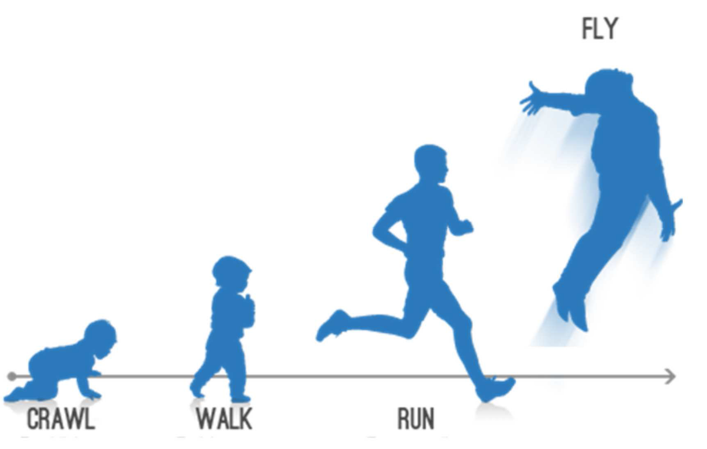
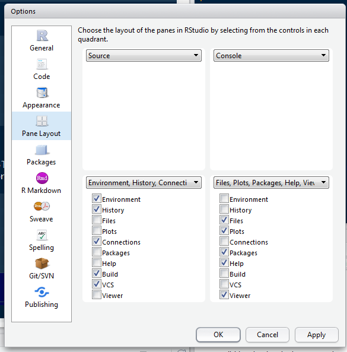
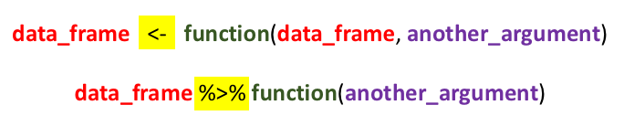

# The purpose of this course

- An introduction to basic techniques in R

- An interdisciplinary approach to R, e.g. regression modelling for psychologists, and text analysis for digital humanities

# Why R?

- *Open Source*
  - means that analyses are (a) cutting edge and (b) accurate
- *Strong emphasis on reproducible research*
  - data are (a) accurately reported (b) shareable

# How to use an R Markdown file

This is an [R Markdown](http://rmarkdown.rstudio.com) Notebook. When you execute code within the notebook, the results appear beneath the code.

Try executing this chunk by clicking the *Run* button within the chunk or by
placing your cursor inside it and pressing *Ctrl+Shift+Enter*.

```{r}
plot(cars)
```

Add a new chunk by clicking the *Insert Chunk* button on the toolbar or by
pressing *Ctrl+Alt+I*.

When you save the notebook, an HTML file containing the code and output will be saved alongside it (click the *Preview* button or press *Ctrl+Shift+K* to
preview the HTML file).

# RStudio breakdown

## Panes

RStudio shows you four panes:

1. The 'Source' pane: the file where you write your code 2. The 'Console' where actual code is run 3. The 'Environment' pane, which shows you variables / datasets 3. The 'Viewer' pane, which shows you plots and help files


You can arrange these in any order using Tools > Global Options.



## Autocomplete

RStudio has fantastic autocomplete capabilites. To autocomplete just press TAB. This is especially useful when loading files as using autocomplete will help you to identify relevant ones.

# R basics

## Setting the 'working directory'

At the very beginning of an R session you MUST set a 'working directory'. This tells R where to look for and save files. To do this type

```setwd("path/to/directory")```

Unfortunately, if you are on a windows machine you will need to change all
backslashes ```\``` to forward slashes ```/```. This is because R follows UNIX conventions which are native to Linux and Mac computers.

If you are not sure what your working directory is type

```getwd()```

## Using R as a calculator

We can use the console for general arithmetic

```{r}
1 + 3 + 5
(2 + 9) / 7
```

We can also create variables, e.g.

```{r}
x <- 10
y <- 21
x*y
```


## Comments

If you'd like to comment on any code you write (i.e. you do not wish R to try to 'run' this code) just add a hash (```#```) or series of hashes in front of it, e.g.

```df <- read.csv("csv_file.csv") # This reads in the main file for the experiment```

## Functions

Most work in R is done using _Functions_. These take the following form:
_function(argument(s))_. Here are some functions

```{r}

sqrt(10)

seq(1,10,2)

```

EX1: What do the arguments of ```seq``` do? To find out more search for the relevant help file in the console by typing ```?seq```

EX2: Have a look at the following arguments called ```gsub``` and ```grepl```. What do they do? Clue: if you're stuck, search the help file using ```?```
```{r}

gsub("R-studio", "Rstudio", "R-studio is a great piece of software")

grepl("chocolate", "Mary likes chocolate cookies")

```

## DIY functions

It's possible to **create your own functions**. This makes R extremely powerful and extendible. We're not going to cover making your own functions in this course, but it's important to be aware of this capability. There are plenty of good resources online for learning how to do this, including [this one](https://www.statmethods.net/management/userfunctions.html)

## Getting help

As we have seen above, to find out about a particular function just type ```?``` and the name of the function into the console, e.g. ```?grepl```. This accesses the help files on your computer. If you'd like to search more broadly type ```??grepl``` and your computer will look online for relevant materials on CRAN (the main R website)

Help files in R are quite densely written and not particularly aimed at beginners. Fortunately there are loads of excellent resources on the internet. Here are some really good sites:

(a) [https://www.statmethods.net/index.html](https://www.statmethods.net/index.html)
(b) [https://stats.idre.ucla.edu/r/modules/](https://stats.idre.ucla.edu/r/modules/)
(c) [https://rseek.org/](https://rseek.org/) - a search engine for all things related to R (because the word 'R' brings up a whole load of irrelevant stuff in Google)
(d) [http://www.cookbook-r.com/](http://www.cookbook-r.com/)

# Packages

## Installation

To enhance the basic capabilities of R, we need to load packages. Most of the
time, we download these from 'CRAN' ```Tools > Install packages``` or ```install.packages()```. Once the package is installed, we then need to _load_ it using the ```library()```function. One of the most useful packages is called 'tidyverse'.


It contains a number of useful commands for plots, and data manipulation.
Install the 'tidyverse' package, and then load it with the following function:

```{r}
library(tidyverse)
```

## Obtaining help

To find out more about a package type ```?package_name``` in the console. Alternatively you can look for the package documntation on [CRAN](https://cran.r-project.org/).

## Using functions from packages

Most of the functions loaded in a package should work 'out of the box'. However occastionally you need to refer to the package first, and then the function using the format ```package_name::function_from_that_package```. This is useful for a variety of reasons:

1. It allows you to use a function from a package without loading the library
2. It helps in cases where you load two packages which contain two different functions which happent to have the same name.
3. Sometimes, even when a package is loaded, you need to precede a function by the package name. However, most of the time this is not necessary.

## Simplifying installation / loading

The **pacman** package is really useful as in a single line you can check whether a package is installed, install it (if not installed), and load the library. We won't be using this in class, but you can explore it at your leisure.

# Objects, data frames and indices

## Objects

A variable is a type of 'object' which R stores in memory. R is capable of
creating and storing a wide range of objects. To see what type of object we have created, we use the function ```class()```, e.g.

```{r}

class(x)

z <- "hello"

class(z)

```

*class* is one of the most useful functions in R as errors are often due to
misassignment of class, e.g.

```{r, error = TRUE}

x + z

```

Here we have tried to add a number to a string which is clearly impossible. It's possible to change the class of an object using commands such as
```as.character```, ```as.integer```, ```as.numeric```, ```as.factor```, e.g.

```{r, error = TRUE}
one <- "1"
x + one
one <- as.numeric(one)
x + one 
```

Here is a list of the main objects in R:

1. Numeric - a number with decimal places
2. Integer - a number without decimal places
3. Character - a string of letters/numbers
4. Vector - an ordered list of numbers or characters
5. Dataframe - a 2 x 2 array in which each column has a name

In order to create a vector we need to use the ```c``` function. (c = 'combine'), e.g.

```{r}
list.of.numbers <- c(1,4,54,22,43,9,0,0,21)

mean(list.of.numbers)

sd(list.of.numbers)
```


## Creating a data frame from scratch

A data frame is a two-dimensional object containing variables and row numbers. It's basically a spreadsheet.

The following code creates a data frame programmatically. It creates two variables, and combines them together to make a data frame. Note that to do this we need to use the functions ```as.data.frame``` and ```cbind```.

```{r}
list.of.movies <- c("Independence Day", "Pretty Woman", "The Godfather Part
Two", "Planet of the Apes (original)")

rotten.tomatoes.variable <- c(62, 61, 97, 89)

df <- as.data.frame(cbind(list.of.movies, rotten.tomatoes.variable)) # 'cbind' binds columns together
```

## Viewing the contents of a data frame

To glimpse the top few rows type ```head(name_of_data_frame)``` in the console, e.g.

```{r}
head(df)
```

To view the data frame in the 'source' window, type ```View(name_of_data_frame)``` in the console, .e.g.

```{r}
View(df) #NB first letter is a capital letter.
```

## Referring to variables

To refer to variables, use the following syntax ```data_frame_name$variable_name```, e.g.
```{r}
df$list.of.movies
```
When naming variables we can use dots and underscores, e.g. ```df$list.of.movies``` and ```df$list_of_movies```. We can use numbers as long as they don't come at the beginning, e.g. ```df$list_of_movies.v3```.

If you use this convention, then the names for variables can get very long. However, it's generally useful, as in R you often have multiple data frames loaded into memory. By specifiying both the name of the data frame and the variable, this avoids confusion.

There IS a way to specify a variable using just the variable name only:

```{r, echo = TRUE, results='asis'}
attach(df)
list.of.movies
detach(df)
```

When you 'attach' a data frame, it allows you to refer to the variables without specifying the name of the data frame. 'Detach' reverses this process.

In general it is good practice to refer to variables using the ```data_frame_name$variable_name``` format. Use of 'attach' should be reserved for situations when the full format leads to unreadable code.

If you'd like to see all the variable names in a data frame type ```names(data_frame)```, e.g. 

```{r}
names(df)
```


## Indices

Whenever you wish to access the contents of an object with multiple values (e.g. a data frame) you use indexes. These are placed inside square brackets, e.g. ```[1]```. Have a look at the following example:


```{r}
df[1,2]

df[1,] # here the second number is blank

df[,2] # here the first number is blank
```

EX3: What does each number refer to? What happens when we leave a blank cell?

## Reading data frames from files using menus

We can use the menu in Rstudio: ```File > Import dataset```. You can do this to import Excel, SPSS, SAS and STATA files.

## Reading data frames from files using code

However, rather than use the menu, it's much better to use actual code, as this will automate the process.

To get set up, we're going to create some datasets in foreign formats. The following lines take a native dataset (mtcars), and write this in a variety of different formats. This is purely to provide you with practice of reading the datasets. Once you've run this code you'll find that three new datasets are created in your directory.

```{r, error = TRUE}
library(tidyverse)
library(xlsx)
write.csv(mtcars, "mtcars.csv")
write.xlsx(mtcars, "mtcars.xlsx")
haven::write_sav(mtcars, "mtcars.sav")  # NB 'haven' is loaded with "tidyverse" but for some reason when you call haven functions you have to also specify the package. I have no idea why
```

Possibly the best data format to work in is the .csv data format. This is good because it is readable in Excel, small, simple, and not easily-corrupted.

To read .csv files we use the ```read.csv()``` function from base R, e.g. 

```{r}
df <- read.csv("mtcars.csv")
```


To read files in other formats use the following packages:

1. .sav files (SPSS) and .dta files (STATA): ```foreign``` and ```haven```
2. Excel files (.xls, .xlsx, xlsm): ```read_r``` (part of the tidyverse) or ```openxlsx```

Let's read the SPSS file

```{r}
df <- haven::read_sav("mtcars.sav")
```

And the Excel files

```{r, error = TRUE}
df <- read.xlsx("mtcars.xlsx", 1)
# NB 1 means that we read from the first tab.
```

# Subsetting a data set using (a) base R and (d) dplyr

## Subsetting with base R

We're going to *subset* the mtcars dataset (i.e. choose only those cases which fulfil a specific criterion). To do this we're going to use the ```which()``` function. When you apply ```which``` to a variable in a dataset, it will produce indices of the rows which fulfil a certain criterio, e.g. ```which(df$var_name == 2)``` will give you the indices of all rows where the value of the variable is 2.

EX4: Armed with this knowledge, your task is to subset the data frame so that it only contains cars with 4 cylinders.

If you're stuck have a look at the answer below. 
  
  
  
  
  
  
  
  
  
  
  
  
  
  
  
  
  
  
  
  
  
  
  
  
  
  


```{r}
df.6cyl <- df[which(df$cyl == 6), ]
```

## Piping

Okay, the above code is pretty horrible to look at, so we're going to explore an alternative using the package ```dplyr``` which is from the ```tidyverse```. But before we can use ```dplyr``` we have to learn how to 'pipe'.


Pipes are written in R as ```%>%``` (note you must use a percentage sign before and after the pipe). To demonstrate what pipes do, I have a look at the following pseudocode.



All pipes do is enable us to 'pass' a data frame (or another object) to a new function without having to keep on specifying the data frame. In addition, we can *chain* pipes together indefinitely.

Here's how we would subset the data frame using piping:

```{r}
df %>% filter(cyl == 6) -> df.6cyl
```

And here is an example where we *chain* a series of pipes together:

```{r}
df %>% group_by(cyl) %>% summarise(mean.mpg = mean(mpg)) -> df.mean.mpg.by.cyl
```


There are a couple of important points to note.

(1) We can refer to variables without specifying the data frame
(2) If we wish to store the results we must output them using and arrow ```->```. If we don't store the results they will merely be displayed in the console.

Piping is a key technique in R and once you've learnt it you will write much more powerful and readable code.

# Loops and if-then statements

Loops and if-then statements are useful programming tools which have the same structure: ```FUNCTION (STATEMENT) {.....}```.

## Loops

To demonstrate a loop we're going to look at the mtcars data set. We're going to ask the question 'for cars of different different numbers of gears what is the relationship between the 'horsepower' and the number of cylinders. (I have no idea if this is a good question to ask!)

Here's how we would do it

```{r}
list.of.num.gears <- unique(df$gear) # Unique shows unique values of a variable

for (i in 1:length(list.of.num.gears)){ # We loop through the list
  df %>% filter(df$gear == list.of.num.gears[i]) -> temp.df # we subset the data according to the number of gears
  model <- cor.test(temp.df$hp, temp.df$cyl) # We do the analysis
  print(paste("Number of gears", list.of.num.gears[i])) # We print the results
  print(model)
}

```

EX5: The code below creates a sequence ranging from 0 to 30 going up in steps of 0.25. Try to achieve the same result using a loop

```{r}
seq(0,30,2.5)
```


## If-then statements

To demonstrate if-then statements, we are going to create a new variable which shows if the mpg is above the mean.

```{r}
df$mpg.above.mean <- 0 # Set variable to 0
mean.mpg <- mean(df$mpg) # Calculate mean mpg
for (i in 1:nrow(df)){
  if(df$mpg[i] > mean.mpg){df$mpg.above.mean[i] <- 1}
}
```

## Evaluating conditions

Here is a much easier way to create the same variable
```{r}
df$mpg.above.mean2 <- as.numeric(df$mpg > mean.mpg)
```
So how does this work? The statement in brackets evaluates to TRUE / FALSE. We then turn this into a number using ```as.numeric```. TRUE evaluates to 1, while FALSE evaluates to 0.

It can be quite useful to chain statements. For example, if we wish to identify cars with both mpg and weight about the mean we could do the following:

```{r}
mean.weight <- mean(df$wt)
df$weight.and.mpg.above.mean <- (df$wt > mean.weight) & (df$mpg > mean.mpg)
```

We can see that there is no car in this category because there is an inverse relationship between weight and miles per gallon.

EX6: Try to identify cars where both the ```disp``` and ```drat``` variables are above the mean.

# Stored results

Whenever you run an analysis in R and save that to an object, the object has an internal structure. To demonstrate this, let's do a simple regression using the mtcars dataset:

```{r}
model <- lm(df$mpg ~ df$wt)
```

To see the results of this regression we type ```model``` or ```summary(model)```. Now let's have a look at the `structure` of this model. There are two ways to do this:

1. Use the ```str``` function, e.g. ```str(model)```
2. Type ```model$```, and then use autocomplete.

We can see that the ```$``` symbol has a dual function in R: firstly, to specify variables within dataframes, and secondly to specify subcomponents of an object.

It is useful to be able to refer to subcomponents of an object so that we can integrate into our report, e.g. the regression yielded a value of `r summary(model)$r.squared`


