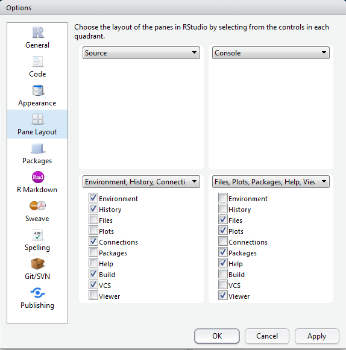

## How to use an R Markdown file

This is an [R Markdown](http://rmarkdown.rstudio.com) Notebook. When you execute
code within the notebook, the results appear beneath the code.

Try executing this chunk by clicking the *Run* button within the chunk or by
placing your cursor inside it and pressing *Ctrl+Shift+Enter*.

```{r} plot(cars) ```

Add a new chunk by clicking the *Insert Chunk* button on the toolbar or by
pressing *Ctrl+Alt+I*.

When you save the notebook, an HTML file containing the code and output will be
saved alongside it (click the *Preview* button or press *Ctrl+Shift+K* to
preview the HTML file).

## RStudio breakdown

RStudio shows you four panes:

1. The 'Source' pane: the file where you write your code 2. The 'Console' where
actual code is run 3. The 'Environment' pane, which shows you variables /
datasets 3. The 'Viewer' pane, which shows you plots and help files


You can arrange these in any order using Tools > Global Options.




## Setting the 'working directory'

At the very beginning of an R session you MUST set a 'working directory'. This
tells R where to look for and save files. To do this type

```setwd("path/to/directory")```

Unfortunately, if you are on a windows machine you will need to change all
backslashes ```\``` to forward slashes ```/```. This is because R follows UNIX
conventions which are native to Linux and Mac computers.

If you are not sure what your working directory is type

```getwd()```

## Using R as a calculator

We can use the console for general arithmetic

```{r}
1 + 3 + 5
(2 + 9) / 7
```

We can also create variables, e.g.

```{r}
x <- 10
y <- 21
x*y
```


##Comments

If you'd like to comment on any code you write (i.e. you do not wish R to try to
'run' this code) just add a hash (```#```) or series of hashes in front of it, e.
g.

```{df <- read.csv("csv_file.csv") # This reads in the main file for the experiment}```

##Functions

Most work in R is done using _Functions_. These take the following form:
_function(argument(s))_. Here are some functions

```{r}

sqrt(10)

seq(1,10,2)

```

What do the arguments of ```seq``` do?

Have a look at the following arguments called ```gsub``` and ```grepl```. What do they do? If you're not sure how to use the function, type ```?``` and the name of the
function in the console, e.g. ```?gsub```.

```{r}

gsub("R-studio", "Rstudio", "R-studio is a greate piece of software")

grepl("chocolate", "Mary likes chocolate cookies")

```


##Getting help

As we have seen above, to find out about a particular function just type ```?``` and the name of the function into the console, e.g. ```?grepl```. This accesses the help files on your computer. If you'd like to search more broadly type ```??grepl``` and your computer will look online for relevant materials on CRAN (the main R website)

##Objects

A variable is a type of 'object' which R stores in memory. R is capable of
creating and storing a wide range of objects. To see what type of object we have
created, we use the function ```class()```, e.g.

```{r}

class(x)

z <- "hello"

class(z)

```

*class* is one of the most useful functions in R as errors are often due to
misassignment of class, e.g.

```{r, error = TRUE}

x + z

```

Here we have tried to add a number to a string which is clearly impossible. It's
possible to change the class of an object using commands such as
```as.character```, ```as.integer```, ```as.numeric```, ```as.factor```, e.g.

```{r, error = TRUE}
one <- "1"
x + one
one <- as.numeric(one)
x + one 
```

Here is a list of the main objects in R:

1. Numeric - a number with decimal places
2. Integer - a number without decimal places
3. Character - a string of letters/numbers
4. Vector - an ordered list of
numbers or characters
5. Dataframe - a 2 x 2 array in which each column has a name

In order to create a vector we need to use the ```c``` function. (c = 'combine'), e.g.

```{r}
list.of.numbers <- c(1,4,54,22,43,9,0,0,21)

mean(list.of.numbers)

sd(list.of.numbers)
```

## Packages

###1. Installation

To enhance the basic capabilities of R, we need to load packages. Most of the
time, we download these from 'CRAN' ```Tools > Install packages```. Once the
package is installed, we then need to _load_ it using the ```library()```
function. One of the most useful packages is called 'tidyverse'.


It contains a number of useful commands for plots, and data manipulation.
Install the 'tidyverse' package, and then load it with the following function:

```{r}
library(tidyverse)
```

###2. Obtaining help

To find out more about a package type ```?package_name``` in the console. Alternatively you can look for the package documntation on [CRAN](https://cran.r-project.org/).

###3. Using functions from packages

Most of the functions loaded in a package should work 'out of the box'. However occastionally you need to refer to the package first, and then the function using the format ```package_name::function_from_that_package```. This is useful for a variety of reasons:

1. It allows you to use a function from a package without loading the library
2. It helps in cases where you load two packages which contain two different functions which happent to have the same name.
3. Sometimes, even when a package is loaded, you need to precede a function by the package name. However, most of the time this is not necessary.

###4. Simplifying installation / loading

The **pacman** package is really useful as in a single line you can check whether a package is installed, install it (if not installed), and load the library. We won't be using this in class, but you can explore it at your leisure.

## Data frames and indices

### 1. Creating a data frame from scratch

A data frame is a two-dimensional object containing variables and row numbers. It's basically a spreadsheet.

The following code creates a data frame programmatically. It creates two variables, and combines them together to make a data frame. Not that to do this we need to use the functions ```as.data.frame``` and ```cbind```

```{r}
list.of.movies <- c("Independence Day", "Pretty Woman", "The Godfather Part
Two", "Planet of the Apes (original)")

rotten.tomatoes.variable <- c(62, 61, 97, 89)

df <- as.data.frame(cbind(list.of.movies, rotten.tomatoes.variable)) # 'cbind' binds columns together
```

### 2. Viewing the contents of a data frame

To glimpse the top few rows type ```head(name_of_data_frame)``` in the console, e.g.

```{r}
head(df)
```

To view the data frame in the 'source' window, type ```view(name_of_data_frame)``` in the console, .e.g.

```{r}
View(df) #NB first letter is a capital letter.
```

### 3. Referring to variables

To refer to variables, use the following syntax ```data_frame_name$variable_name```, e.g.

```{r}
df$list.of.movies
```

If you use this convention, then the names for variables can get very long. However, it's generally useful, as in R you often have multiple data frames loaded into memory. By specifiying both the name of the data frame and the variable, this avoids confusion.

There IS a way to specify a variable using just the variable name only:

```{r}
attach(df)
list.of.movies
detach(df)
```

When you 'attach' a data frame, it allows you to refer to the variables without specifying the name of the data frame. 'Detach' reverses this process.

In general it is good practice to refer to variables using the ```data_frame_name$variable_name``` format. Use of 'attach' should be reserved for situations when the full format leads to unreadable code.

If you'd like to see all the variable names in a data frame type ```names(data_frame)```, e.g. 

```{r}
names(df)
```


### 4. Indices

Whenever you wish to access the contents of an object with multiple values (e.g. a data frame) you use indexes. These are placed inside square brackets, e.g. ```[1]```. Have a look at the following example:


```{r}
df[1,2]
```

The first value refers to the row number, while the second refers to the column number. So this gives the values for the first row and second column (i.e. the first row of the rotten.tomatoes.variable)


To refer to a particular cell in this data frame we need to use indices. The first refers to the row

### 5. Reading dataframes from files

R is not the best piece of software for inputting data. You will probably be doing this in Excel. We're now going to practice reading in data in Excel and SPSS formats.

The following lines take a native dataset (mtcars), and write this in a variety of different formats. This is purely to provide you with practice of reading the datasets. Once you've run this code you'll find that three new datasets are created in your directory.

```{r}
library(tidyverse)
library(xlsx)
write.csv(mtcars, "mtcars.csv")
write.xlsx(mtcars, "mtcars.xlsx")
haven::write_sav(mtcars, "mtcars.sav")
```

Possibly the best data format to work in is the .csv data format. This is good because it is readable in Excel, small, simple, and not easily-corrupted.

To read .csv files we use the ```read.csv()``` function, e.g. 

```{r}
df <- read.csv("mtcars.csv")
```


To read files in other format use the following packages:

1. .sav files (SPSS) and .dta files (STATA): ```foreign```
2. Excel files (.xls, .xlsx, xlsm): ```read_r``` (part of the tidyverse) or ```openxlsx```

Let's read the excel files

```{r}
df <- read_x
```


## Piping


###Assigning values