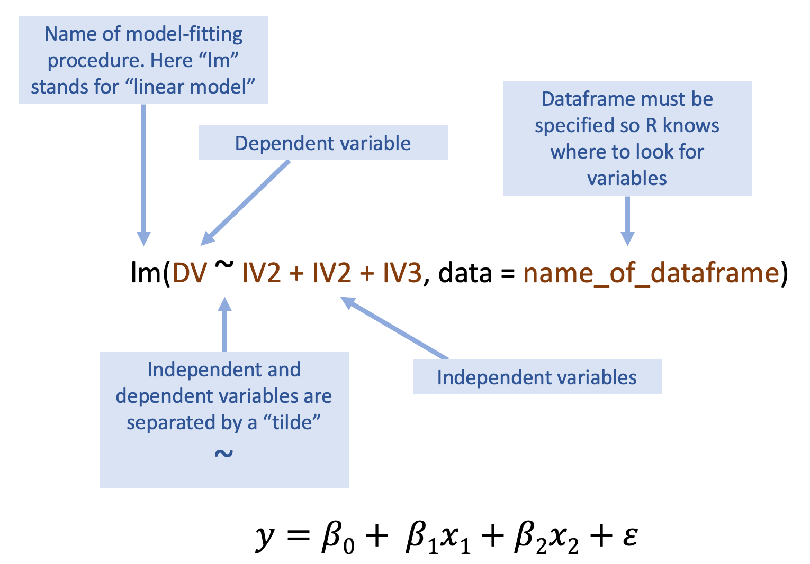
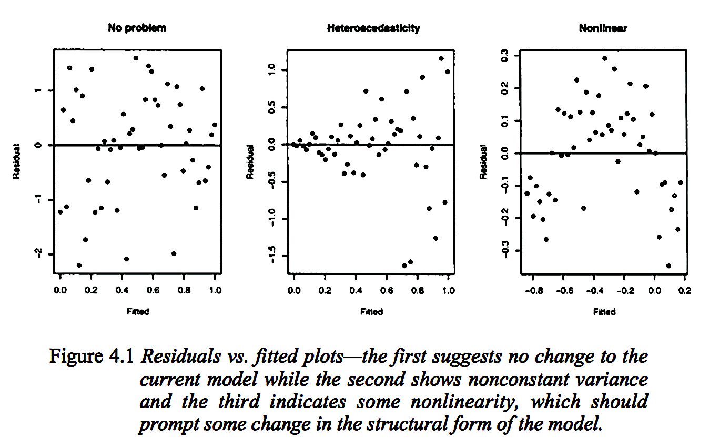

```{r settings}
library(tidyverse)
library(broom)
library(graphics)
library(pacman)
```


# Advantages of R for data analysis

1. Cutting edge analyses. In psychology R is the standard package to run mixed effects models
2. Range of statistical modules. It's huge and much larger than commercial packages, e.g. SPSS
3. Transparency of code. The code resembles the underlying mathematical model.
4. Statistical models are stored in memory and are open to exploration/interrogation. For example, it is easy to inspect the residuals of our model.

# Correlations

## Simple pairwise correlation

Main function for a pairwise correlation is `cor.test`. Have a look at the example. Note that we have used the `apa` library to turn this into a nice output.

```{r}

df = read_csv("WHR_2017.csv")

cor = cor.test(df$gdp_per_capita, df$happiness_score)

library(apa)

cor_apa(cor)

```

Or report inline like this: The correlation between GDP per capita and happiness scores is `r cor_apa(cor)`.

Note that there is an option to choose the method: `method = c("pearson", "kendall", "spearman")`

## Multiple pairwise comparisons

This is a bit more tricky. The best approach is to create a dataframe containing only those variables that you wish to conduct the pairwise correlations on.

```{r}

df %>% 
  select(happiness_score, gdp_per_capita, life_expectancy, family, freedom, generosity, trust_in_government) ->
  df.cor

cor(df.cor)

library(corrtable)

cm =   correlation_matrix(
          df.cor,
          type = "pearson",
          digits = 2,
          decimal.mark = ".",
          use = "all",
          show_significance = TRUE,
          replace_diagonal = FALSE,
          replacement = ""
)

cm

library(corrplot)

corrplot(cor(df.cor))

```


# Running a model

## Basic syntax of a regression model



```{r}

df = read_csv("WHR_2017.csv")

mod_hs_gdp = lm(happiness_score ~ gdp_per_capita, data = df)

# "mod" = model.
# "hs_gdp" = hs is predicted by gdp

mod_hs_gdp # This shows you the key statistics, but it's not very informative

summary(mod_hs_gdp) # This is much more informative but it's not pretty to look at

tidy(summary(mod_hs_gdp)) # `tidy` from the `broom` package makes it into a very nice table

```


## Model diagnostics

But is it a good model for the data. Let's do a plot to find out.

```{r}

g = ggplot(data = df, aes(x = gdp_per_capita, y = happiness_score))
g = g + geom_point()
g = g + geom_smooth()
g

```


```{r}
residuals = resid(mod_hs_gdp)

hist(residuals, breaks = 20)

plot(fitted(mod_hs_gdp), residuals)
abline(0,0)

qqnorm(residuals)
qqline(residuals)

```

Residuals are close to normally distributed, according to both the histograms and QQ-plot. The relationship between residuals and fitted values does not suggest a problem.



## EX1 - Over to you!

Now switch the dependent variable to life expectancy. Do you think that the relationship will be linear? Why? Why not?

Test your assumptions by

(a) running a linear model
(b) running regression diagnostics.

You can use the above code as a crib, but try to refer to it as little as possible. The answer is below, but try not to look at it when doing this exercise.


```{r}

df = read_csv("WHR_2017.csv")

mod_le_gdp = lm(life_expectancy ~ gdp_per_capita, data = df)

# "mod" = model.
# "hs_gdp" = hs is predicted by gdp

mod_le_gdp # This shows you the key statistics, but it's not very informative

summary(mod_le_gdp) # This is much more informative but it's not pretty to look at

tidy(summary(mod_le_gdp)) # `tidy` from the `broom` package makes it into a very nice table

```

```{r}
residuals = resid(mod_le_gdp)

hist(residuals, breaks = 20)

plot(fitted(mod_le_gdp), residuals)
abline(0,0)

qqnorm(residuals)
qqline(residuals)

```


```{r}

g = ggplot(data = df, aes(x = gdp_per_capita, y = life_expectancy))
g = g + geom_point()
g = g + geom_smooth()
g

```

So, the relationship is fairly linear, but there are a couple of issues. First of all there is a natural ceiling to life expectancy so that it does not improve beyond a certain GDP. Secondly, there are some countries shoe life expectancy is much lower than their GDP would predict. Can you guess which countries fall into this category?


