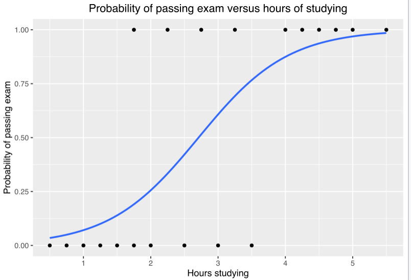

```{r setup}
library(tidyverse)
library(broom)
library(graphics)
library(pacman)
theme_set(theme_bw()) # Set the standard black and white theme
```

# Advantages of R for data analysis

1. *Cutting edge* analyses. In psychology R is the standard package to run _mixed effects models_. It also interfaces with _Stan_ (Bayesian Analysis), via a package called _brms_
2. *Variety* of statistical methods. It's huge and much larger than commercial packages, e.g. SPSS
3. *Transparency* of code. The code resembles the underlying mathematical model.
4. Statistical models are *stored in memory *and are open to exploration/interrogation. For example, it is easy to inspect the residuals of our model.

# Correlations

## Simple pairwise correlation

Main function for a pairwise correlation is `cor.test`. Have a look at the example. Note that we have used the `apa` library to turn this into a nice output.

```{r reading in data and running a pairwise correlation}

df = read_csv("WHR_2017.csv")

cor = cor.test(df$gdp_per_capita, df$happiness_score)

# Note that there is an option to choose the method: `method = c("pearson", "kendall", "spearman")`

cor

```

Okay, we have reported this, but it doesn't look very "publication-ready". R has a range of packages which convert the results of analyses into publication-ready formats.


```{r reporting correlation results "in-line"}

library(apa) # APA-style reporting of statistical tests

cor_apa(cor)

```

Often, you will need to report your results "in-line" (i.e. in the body of your text). To do this in R you use backticks. There are 3 backticks for a block, but only 1 for in-line code (and no curly brackets).

For example... the correlation between GDP per capita and happiness scores is `r cor_apa(cor)`.


## EXERCISE - EXPLORING CORRELATIONS

Explore other correlations in the data!!

```{r GO EXPLORE!}


```


## Multiple pairwise comparisons

This is a bit more tricky. The best approach is to create a dataframe containing only those variables that you wish to conduct the pairwise correlations on. The `cor` function from base R creates a correlation matrix. But results are not very publication-ready. They can be tidied up via the `kable` package (in `knitr`). There is also the fantastic `corrplot` which will give you a great graphical representation.

```{r creating correlation tables}

df %>% 
  select(happiness_score, gdp_per_capita, life_expectancy, family, freedom, generosity, trust_in_government) ->
  df.cor

cor(df.cor)

library(corrtable)

cm =   correlation_matrix(
          df.cor,
          type = "pearson",
          digits = 2,
          decimal.mark = ".",
          use = "all",
          show_significance = TRUE,
          replace_diagonal = TRUE,
          replacement = ""
)

cm

knitr::kable(cm, "html")

library(corrplot)

corrplot(cor(df.cor))

```


# Running a model

## Basic syntax of a regression model


```{r running and reporting a linear model}

df = read_csv("WHR_2017.csv")

mod_hs_gdp <- lm(happiness_score ~ gdp_per_capita, data = df)

# "mod" = model.
# "hs_gdp" = hs is predicted by gdp

mod_hs_gdp # This shows you the key statistics, but it's not very informative

summary(mod_hs_gdp) # This is much more informative but it's not pretty to look at

tidy(summary(mod_hs_gdp)) # `tidy` from the `broom` package makes it into a very nice table

# or to make this a bit more "publication-ready"

knitr::kable(tidy(summary(mod_hs_gdp)))

```

The table looks nice, but often, at least in Psychology, results are reported in-line. A good way to do this is to create your own function.

```{r create function to report terms in model}

report_coef = function(mod){
  sm = summary(mod)
  results_vector = rep("", length(mod$coefficients))
  for (i in 1:length(mod$coefficients)){
    results_vector[i] = paste0("β = ", round(sm$coefficients[i, 1], 2), ", t = ", round(sm$coefficients[i, 3], 2), ", p = ", sprintf("%.3f", round(sm$coefficients[i, 4], 3)))
  }
  return(results_vector)
}
  
```

There was a significant effect of GDP per capita: `r report_coef(mod_hs_gdp)[1]`

NB the code to create the function is tricky. It took me 20 minutes to write with a lot of googling. A newbie would spend much longer. However, if you are writing a thesis which involves the in-line reporting of the results of a large number of linear models, this could save you a lot of time in the long run.

## Model diagnostics

But is it a good model for the data. Let's do a plot to find out.

```{r plotting the data}

g = ggplot(data = df, aes(x = gdp_per_capita, y = happiness_score))
g = g + geom_point()
g = g + geom_smooth()
g

```


```{r plotting the residuals}
residuals = resid(mod_hs_gdp)

hist(residuals, breaks = 20)

# NB residuals can also be obtained by peeking inside the stored model.

hist(mod_hs_gdp$residuals, breaks = 20)

plot(fitted(mod_hs_gdp), residuals)
abline(0,0)

# Note that both lines need to be run at the same time.
# To do this, you can use a semi-colon.

plot(fitted(mod_hs_gdp), residuals); abline(0,0)

# And here is a qq-plot. It plots the actual residuals against "theoretical" residuals based on the assumption that they are normally distributed.

qqnorm(residuals); qqline(residuals)

```

Residuals are close to normally distributed, according to both the histograms and QQ-plot. The relationship between residuals and fitted values does not suggest a problem.


## EXERCISE - IMPACT OF GDP ON LIFE EXPECTANCY

Now switch the dependent variable to life expectancy. Do you think that the relationship will be linear? Why? Why not?

Test your assumptions by

(a) running a linear model
(b) running regression diagnostics.

You can use the above code as a crib, but try to refer to it as little as possible. The answer is below, but try not to look at it when doing this exercise.

```{r OVER TO YOU!!!}


```


```{r }

df = read_csv("WHR_2017.csv")

mod_le_gdp = lm(life_expectancy ~ gdp_per_capita, data = df)

# "mod" = model.
# "hs_gdp" = hs is predicted by gdp

mod_le_gdp # This shows you the key statistics, but it's not very informative

summary(mod_le_gdp) # This is much more informative but it's not pretty to look at

tidy(summary(mod_le_gdp)) # `tidy` from the `broom` package makes it into a very nice table

```

```{r}
residuals = resid(mod_le_gdp)

hist(residuals, breaks = 20)

plot(fitted(mod_le_gdp), residuals); abline(0,0)

qqnorm(residuals); qqline(residuals)

```


```{r}

g = ggplot(data = df, aes(x = gdp_per_capita, y = life_expectancy))
g = g + geom_point()
g = g + geom_smooth()
g

```

```{r}

g = ggplot(data = df, aes(x = gdp_per_capita, y = life_expectancy, label = country))
g = g + geom_point(colour = "light blue")
g = g + geom_smooth(se = FALSE)
g = g + geom_text(size = 2.5, nudge_y = -0.02, alpha = 0.6)

g

```


So, the relationship is fairly linear, but there are a couple of issues. First of all there is a natural ceiling to life expectancy so that it does not improve beyond a certain GDP. Secondly, there are some countries where life expectancy is much lower than their GDP would predict. Can you guess which countries fall into this category?

## Piping within models / ggplot

You can add piping within models / plots, e.g.

```{r piping within models and plots}


g = ggplot(data = df %>% filter(region != "Europe"),
           aes(x = gdp_per_capita, y = life_expectancy))
g = g + geom_point()
g = g + geom_smooth()
g

mod_le_gdp_no_europe = lm(life_expectancy ~ gdp_per_capita,
                          data = df %>% filter(region != "Europe"))

```


# Generalised linear model

A variety of models which are designed for data where distributions depart radically from the normal distribution.

1. *Logistic regression* for dichotomous (binary) data
2. *Poisson regression* for count data (which tends to have a right skew)
3. *Negative binonmial* for poisson-type data where rightward skew is extremely severe

We're going to look at logistic regression.


Therefore we need to use a special mathematical transformation to turn it into a straight line. This transformation is "built into" the model.

## Dichotomising a variable

We're going to turn one of our variables into a dichotomous variable using a "median-split"

```{r creating a median split}

df$happiness_score_ms = as.numeric(df$happiness_score >= median(df$happiness_score))

```

Now we're going to run our regression model. We're going to look at whether GDP influences whether happiness is above or below the mdedian.

## EXERCISE - USING GOOGLE TO RUN A LOGISTIC REGRESSION


```{r FIGURE OUT HOW TO RUN A LOGISTIC REGRESSION!}


```


```{r}

mod = glm(happiness_score_ms ~ gdp_per_capita, data = df, family = "binomial")

mod

summary(mod)

```

Because the coefficient is hard to interpret, we need to convert it into odds ratios. This value will be 1 if there is no relationship, > 1 if there is a positive relationship and < 1 if there is a negative relationship. We used the `exp` function to do this.

```{r}

exp(coef(mod))

exp(mod$coefficients)

```

NB This odds ratio is far too large. A possible issue is that we have not "scaled" our independent variable. Scaling will give a mean of zero and a standard deviation of plus or minus one.


```{r}

mod = glm(happiness_score_ms ~ scale(gdp_per_capita), data = df, family = "binomial")

exp(coef(mod))

```

This is a more "sensible" odds ratio.


